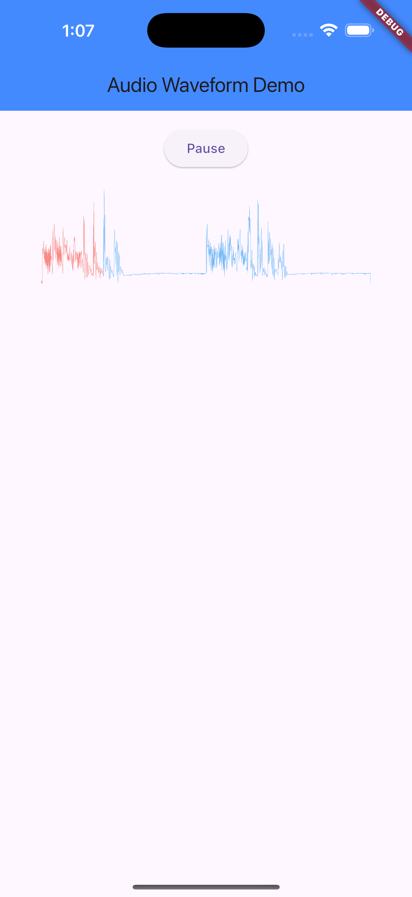

# Waveform

Waveform is a Flutter application designed to visualize audio waveforms in
real-time. This project serves as a starting point for Flutter developers
looking to create applications with audio visualization features.

## Features

- **Real-time Audio Visualization**: Display audio waveforms as the audio plays.
- **Customizable Waveform Styles**: Choose from various waveform styles to suit
  your application's theme.
- **Cross-Platform Support**: Runs on both iOS and Android devices.

## Getting Started

These instructions will help you set up the project on your local machine for
development and testing purposes.

### Prerequisites

- **Flutter SDK**:
  [Installation guide](https://flutter.dev/docs/get-started/install)
- **Dart SDK**: [Installation guide](https://dart.dev/get-dart)
- Any other dependencies or tools required

### Installation

1. Clone the repository:
   ```bash
   git clone https://github.com/alimaherofficial/flutter-waveform.git
   ```
2. Navigate to the project directory:
   ```bash
   cd waveform
   ```
3. Install dependencies:
   ```bash
   flutter pub get
   ```

### Running the App

To run the app on your local machine, use the following command:

```bash
flutter run
```

## Usage



To use the app, simply load an audio file, and the waveform will be displayed in
real-time. You can customize the appearance of the waveform through the settings
menu. For more detailed instructions, refer to the in-app help section.

## Contributing

Contributions are welcome! Please follow these steps to contribute:

1. Fork the repository.
2. Create a new branch:
   ```bash
   git checkout -b feature/YourFeature
   ```
3. Make your changes and commit them:
   ```bash
   git commit -m 'Add some feature'
   ```
4. Push to the branch:
   ```bash
   git push origin feature/YourFeature
   ```
5. Open a pull request.

## License

This project is licensed under the MIT License - see the [LICENSE](LICENSE) file
for details.

## Acknowledgments

- [Flutter Documentation](https://docs.flutter.dev/)
- [Dart Documentation](https://dart.dev/guides)
- [flutter_audio_waveforms Package](https://pub.dev/packages/flutter_audio_waveforms)

For more information, visit the
[online documentation](https://docs.flutter.dev/), which offers tutorials,
samples, guidance on mobile development, and a full API reference.
